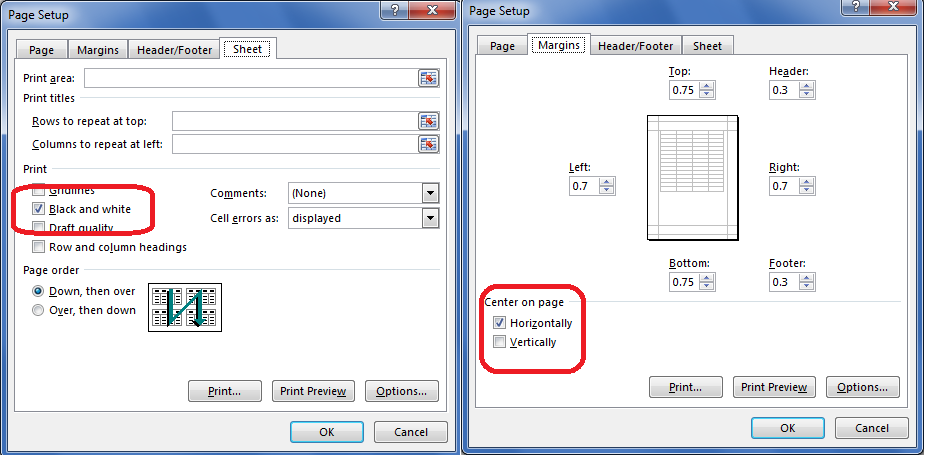

## **Introduction**
This example shows how to work with CellsObjectOperate Task using Aspose.Cells for Cloud API in your applications. You can use our REST API with any language: .NET, Java, PHP, Ruby, Rails, Python, jQuery and many more.
## **Source and Output Excel Files and Screenshot showing Updated PageSetup Properties**
Please upload the [source excel file](attachments/1540329/1837215.xlsx) in your Cloud File System to run the example. After execution of the code you will get this [output excel file](attachments/1540329/1837216.xlsx). The following screenshot shows the updated **PageSetup** properties of the **Days** sheet.


## **Resource**
The following Aspose.Cells for Cloud REST API resource has been used in the examples: [task](), [CellsObjectOperate task](), [saveResult task]().
## **REST Methods References**
We're referring some common methods in the REST examples to perform general operations. These methods can be found at the following page: [REST API Methods](http://www.aspose.com/docs/display/rest/REST+API+Methods)
## **REST Examples**
**C#**

```csharp

string xml = @"

<TaskData>

  <Tasks>

    <TaskDescription>

      <TaskType>CellsObjectOperate</TaskType>

      <CellsObjectOperateTaskParameter>

        <OperateObject>

          <OperateObjectType>PageSetup</OperateObjectType>

          <Position>

            <Workbook>

              <FileSourceType>CloudFileSystem</FileSourceType>

              <FilePath>DaysMonths.xlsx</FilePath>

            </Workbook>

            <SheetName>Days</SheetName>

          </Position>

        </OperateObject>

        <PageSetupOperateParameter>

          <OperateType>Update</OperateType>

          <PageSetup>

            <BlackAndWhite>true</BlackAndWhite>

            <CenterHorizontally>true</CenterHorizontally>

          </PageSetup>

        </PageSetupOperateParameter>

        <DestinationWorkbook>

          <FileSourceType>InMemoryFiles</FileSourceType>

          <FilePath>Temp.xlsx</FilePath>

        </DestinationWorkbook>

      </CellsObjectOperateTaskParameter>

    </TaskDescription>

    <TaskDescription>

      <TaskType>SaveResult</TaskType>

      <SaveResultTaskParameter>

        <ResultSource>InMemoryFiles</ResultSource>

        <ResultDestination>

          <DestinationType>OutputStream</DestinationType>

          <InputFile>Temp.xlsx</InputFile>

          <OutputFile>Output.xlsx</OutputFile>

        </ResultDestination>

      </SaveResultTaskParameter>

    </TaskDescription>

  </Tasks>

</TaskData>

";

ServiceHelper helper = new ServiceHelper(sid, key);

using (HttpWebResponse response = helper.CallPost("http://api.aspose.com/v3.0/cells/task/runtask", xml, "application/xml"))

{

    if (response.StatusCode == HttpStatusCode.OK)

    {

        System.Console.WriteLine("OK");

        Stream st = response.GetResponseStream();

        FileStream fs = new FileStream("Output.xlsx", FileMode.OpenOrCreate);

        st.CopyTo(fs);

    }

}


```
